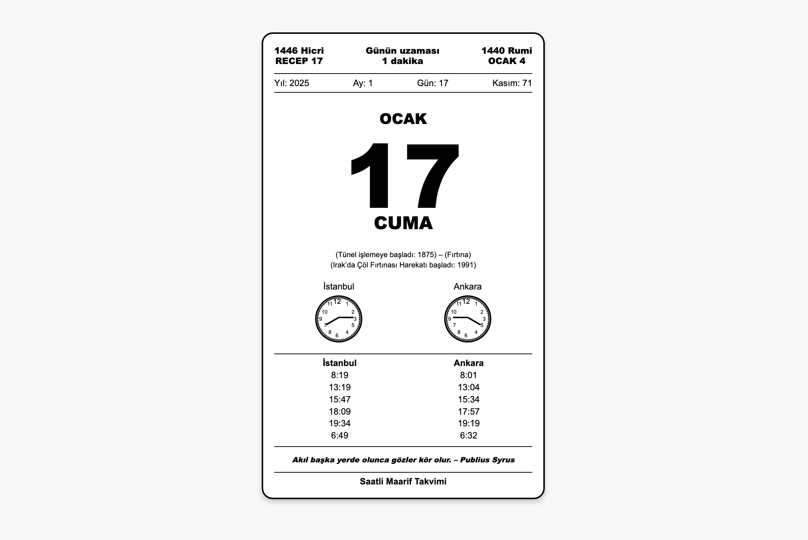

# Saatli Maarif Takvimi

Bu proje, modern bir görünüme sahip **Saatli Maarif Takvimi** uygulamasıdır. Hicri, Rumi ve Miladi tarihleri içeren bu takvim, dua saatleri, önemli gün bilgileri ve şehir saatlerini bir arada sunar.

Link: https://makalin.github.io/Saatli-Maarif-Takvimi/

## Özellikler

- **Hicri, Rumi ve Miladi Tarih Gösterimi**: Aynı anda üç farklı takvimi görüntüleme imkanı.
- **Şehir Saatleri**: İstanbul ve Ankara şehirlerine özel saat göstergesi.
- **Namaz Vakitleri**: İstanbul ve Ankara için günlük namaz vakitleri.
- **Gün Uzaması Bilgisi**: Her gün için günün uzama süresi.
- **Alıntılar ve Önemli Günler**: Güne anlam katan bir alıntı ve tarihsel olaylar.

## Kullanılan Teknolojiler

- **HTML**: Yapısal tasarım ve içerik.
- **CSS**: Stil ve tasarım detayları.
- **SVG**: Saat göstergeleri için vektörel grafikler.

## Proje Yapısı

```plaintext
proje-dizini/
├── index.html       # Ana HTML dosyası
├── styles.css       # Stil dosyası
```

## Kurulum

1. Proje dosyalarını indirin veya kopyalayın.
2. `index.html` dosyasını tarayıcınızda açarak projeyi görüntüleyin.

## Ekran Görüntüsü



## Geliştirme

Bu projeyi geliştirmek için şu adımları izleyebilirsiniz:

1. `styles.css` dosyasını düzenleyerek tasarım değişiklikleri yapabilirsiniz.
2. `index.html` dosyasına ek bileşenler veya özellikler ekleyebilirsiniz.
3. İlgili şehirlerin namaz vakitlerini eklemek için `index.html` dosyasındaki `prayer-times` bölgesini düzenleyin.

## Lisans

Bu proje MIT lisansı ile lisanslanmıştır. Daha fazla bilgi için `LICENSE` dosyasını inceleyin.

---
Bu proje, klasik takvim formatını modern bir tasarımla yeniden hayata geçirmeyi amaçlamaktadır.
